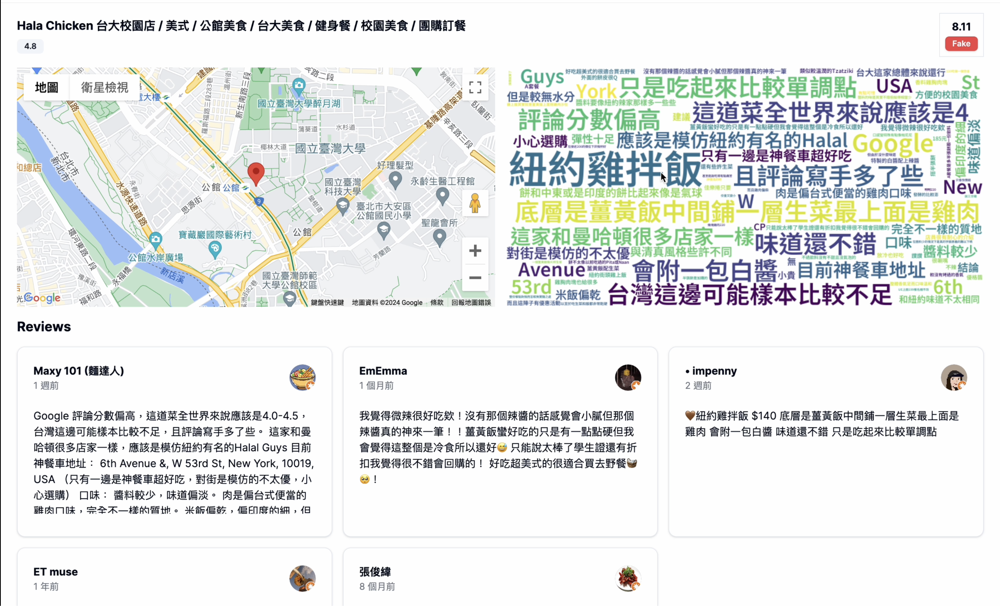

# Certif-Eye 👀

<p align="center">
  
</p>

- We have created an AI-powered platform dedicated to identifying and verifying the authenticity of restaurant reviews. On this website, users can:

  **Check Review Authenticity** - Input review text to get an authenticity score.

  **Browse Restaurant Information** - View ratings, reviews, and word clouds for specific restaurants.

  **Analyze Review Trends** - Understand overall restaurant ratings through visualized data.

### 👀 Feature Introduction

- **Review Analysis:**
    - Input review text for authenticity analysis
    - Display authenticity score for reviews
- **Restaurant Information:**
    - Show restaurant location, ratings, and reviews
    - Generate word clouds from reviews
    - Display restaurant's percentile ranking among all ratings
- **Map Functionality:**
    - Display restaurant locations
- **Interface:**
    - Responsive design
    - Intuitive user interface
- **Automated Web Scraping:**
    - Regularly collect new restaurant reviews from popular platforms
    - Update database with fresh review data
    - Ensure up-to-date analysis and trends

### 👀 Frameworks / Modules / Third-Party Packages Used

#### Frontend:
- React.js, Next.js
- UI components: shadcn-ui
- Map functionality: @vis.gl/react-google-maps

#### Backend:
- Flask API
- Machine Learning model: PyTorch
- Data processing: pandas, numpy
- Natural Language Processing: googletrans, wordcloud
- Web scraping: Beautiful Soup, Selenium

#### Development Tools:
- Code formatting and linting: eslint, prettier
- Type checking: typescript

### 👀 How to Install and Test on Localhost

1. Clone this repository:
   ```
   git clone https://github.com/guan404ming/certif-eye.git
   cd certif-eye
   ```

2. Install frontend dependencies:
   ```
   bun install
   ```

3. Install backend dependencies:
   ```
   pip install -r requirements.txt
   ```

4. Set up environment variables:
   - Create a `.env` file in the project root
   - Add necessary environment variables (e.g., database URL, API keys, etc.)

5. Run the development servers:
   - Frontend:
     ```
     bun run next-dev
     ```
   - Backend:
     ```
     bun run flask-dev
     ```

6. Open [http://localhost:3000](http://localhost:3000) with your browser to see the result.

### 👀 Contributing

Pull requests are welcome. For major changes, please open an issue first to discuss what you would like to change.

### 👀 License

[MIT](https://choosealicense.com/licenses/mit/)
